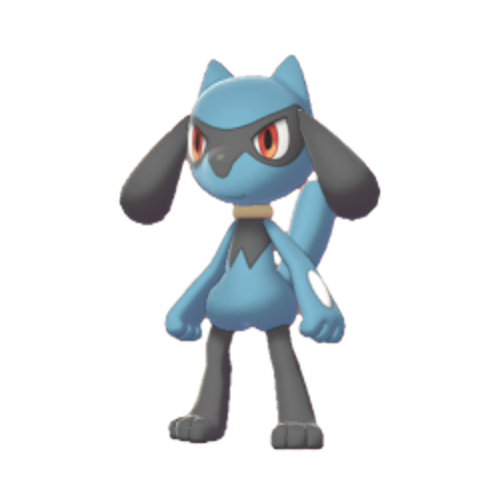

# Discover-Data-Quality-With-RIOLU-A-Replication-Package

### The repository contains the replication package for the paper "Automated, Unsupervised, and Auto-parameterized Inference of Data Patterns and Anomaly Detection".
### RIOLU: Regex Inferencer autO-parameterized Learning with Uncleaned data
{width=100px, height=100px}


## Introduction
The workflows of our tool (Auto-RIOLU and Guided-RIOLU) are shown in the following graph:


**Column Sampling:** Sample a subset of data from the column to generate the patterns. 

**Coverage Rate ($r\_{cov}$) Estimation:** Estimate the percentage of healthy values ($r\_{cov}$) in each column using either the supervised or unsupervised method.

**Constrained Template Generation:** Constrained Template Generation: Generate raw templates for each record with an exact matching rate $r_{EM}$ ($r_{EM}$=$r\_{cov}$ in our study) as a granularity constraint.

**Pattern Generation:** Generate pattern constraints for each template according to the coverage rate ($r\_{cov}$).

**Pattern Selection:** Select patterns based on some heuristics (e.g., their generalizability). 

## Dependencies

- Python >= 3.8

- Pandas == 1.5.3

- Numpy == 1.24.3

- Scikit-learn == 1.3.2

- Matplotlib == 3.7.5

## Dataset

### Source
We use the DOMAINS dataset documented in FlashProfile for data profiling evaluation. The original data is shared through https://github.com/SaswatPadhi/FlashProfileDemo/tree/master/tests. According to the instructions, we removed the extreme-size data (containing <40 or >100k records) and the duplicates. The files for the DOMAINS dataset can be accessed through the ```test_data_profiling``` folder. 

We use the modified version of the Hospital, Flights, and Movies dataset (https://github.com/visenger/clean-and-dirty-data, https://github.com/BigDaMa/raha/tree/master/datasets) for data anomaly detection task. The modified versions are available in ```test_anomaly_detection``` folder, and the ground truths for these data are in the ```ground_truth_anomaly_detection``` folder (-1 for null values, 1 for anomalies, 0 for non-anomalies). 

## Experiments
The procedure for replicating our experiments is as follows:

### Data Profiling
Run code ```test_profiling.py``` to get the data profiling result provided by RIOLU's pattern generation module. The patterns for each file, overall precisions, and overall recalls will be printed in the output, and a graphic result will be automatically stored in the folder. 

An example of the printed graph: 


### Anomaly Detection
The two anomaly detection tools read the dataset in the ```test_anomaly_detection``` folder. Change the variable of ```dataset``` in the code to specify the desired dataset (valid data in our folder: hosp_1k, hosp_10k, hosp_100k, movies), the code will automatically read the ground truth to fetch the columns to be tested (not all the columns contain pattern anomalies). 

#### Unsupervised Version (Auto-RIOLU)


Run code ```Auto-RIOLU.py``` to get the result of the unsupervised version of RIOLU; the predicted CSV file will be stored. 

#### Supervised Version (Guided-RIOLU)


Run code ```Guided-RIOLU.py```to get the result of the supervised version of RIOLU; the predicted CSV file will be stored. We use the cleaned version of each dataset as a support to estimate the coverage rate ($r\_{cov}$). 

## Plug and Play: RIOLU for others
### Pattern Generator
Our pattern generator (```pattern_generator.py```) can generate a pattern pool with a water flow structure. Run the following code to create patterns and get the actual coverage of each pattern (i.e., the frequency of matching of each pattern on the whole dataset). 

```python
generator = PatternGenerator(sampled_data, coverage_rate)
generator.pattern_coverage_statictics()
pattern_statistics = generator.pattern_coverage
```

Workflow example with DateTime column:


### Pattern Selector
Our pattern selector (```pattern_selector.py```) can select patterns dynamically using the 2-class K-Means clustering technique. To select patterns, you should input a dictionary containing patterns and their frequencies (e.g., {"[0-9]+":0.80980980980981, "[0-9]+[a-z][0-9]+$": 0.135, ...}). The output will be a list of selected patterns. 

```python
selector = PatternSelector(pattern_coverage)
selector.select_patterns()
pattern_pool = selector.pattern_pool
```

### ChatGPT Comparison
To validate the effectiveness of RIOLU, we also prompted ChatGPT to generate regexes and flag anomalies as a comparison. 

#### Prompt template for pattern-based data profiling:
```
Hi ChatGPT, given the following data (in a column), please provide me with regular expressions for data profiling that represent the column:
*** Your Column Goes Here ***
```
The responses and regexes for pattern-based data profiling can be found in the ```test_data_profiling``` folder.

#### Prompt template for pattern violation detection:
```
Hi ChatGPT, given the following data (in a column), please accomplish the following two tasks:
1. Provide me with regular expressions that represent the column.
2. Provide me with anomalous cases in the column.
*** Your Column Goes Here ***
```
The regexes for pattern violation detection can be found in the ```test_anomaly_detection``` folder.

