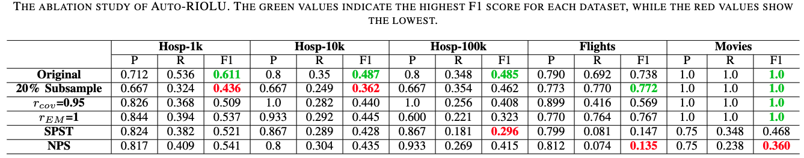

# Understand Our Design Choices!

## Variation Introduction
We introduce the details of the variations we created for our ablation study. Recall that Auto-RIOLU for pattern anomaly detection contains five components: ```column sampling```, ```$r\_{cov}$ estimation```, ```constrained template generation```, ```pattern generation```, and ```pattern selection```. The ```pattern generation``` process follows a set of rules suggested by Raman *et al.* and Ilyas *et al.* and is the core component of RIOLU. Hence, it is not modifiable nor removable in the ablation study. We provide descriptions for other component variations as follows:
- __20% Column Sampling__. In this variant, we follow the experiment setting in FlashProfile and sample 20% of the records in the ```column sampling``` process for pattern generation.
- __Static $r\_{cov}$=0.95__. In this variant, we remove the ```$r\_{cov}$ estimation``` component and use the default $r\_{cov}$=0.95 for pattern inference.
- __Static $r\_{EM}$=1__. In this variant, we set $r\_{EM}$=1 in the ```constrained template generation``` process to exactly match every record into their corresponding templates.
- __Static Pattern Selection Threshold__. In this variant, we use a static selection threshold instead of K-Means clustering in the ```pattern selection``` process: patterns with a frequency larger than 0.01 are selected. 
- __No Pattern Selection__. In this variant, we remove the ```pattern selection```  process and accept all the generated patterns. 

## Our Findings
We gathered the precision(P)/recall(R)/f1 score(F1) of each variation in the following table. To ensure stability, the results were averaged across 5 independent runs, aligning with the settings in Sec IV-B. 



- __20% Column Sampling__. This variant might lead to under-generalization when the error rate is not extremely high, or the data size is small (e.g., containing ~1k records). However, we noticed that sampling more data points can slightly increase the accuracy of $r\_{cov}$ estimation and boost the performance when the error rate is high (e.g., the *Flights* dataset). 
- __Static $r\_{cov}$=0.95__. This variant has faith in your dataset. By setting $r\_{cov}$ to 0.95, the generated patterns learn from and can cover a wide majority of the records (~95%). Therefore, the filtered records have high confidence to be anomalies. The overly optimistic learning assumption is not generalizable when the actual error rate increases. 
- __Static $r\_{EM}$=1__. This variant assumes that the healthy patterns are highly similar in structure and vary largely with the anomalies. However, exact matching of every record may cause undergeneralization and decrease the number of evidence provided to the healthy template: some parts of the anomalies may serve as useful information in learning (e.g., the "a.m." slice in an anomalous record "ab:cd a.m." in a time column). With fewer records matched into the healthy template, the inference tends to be less robust. We noticed that setting $r\_{EM}$ to 1 benefits the *Flights* dataset. Due to the high volume and heterogenetic of anomalies, fully splitting all the records can avoid them in biasing the inference process. 
- __Static Pattern Selection Threshold(SPST)/No Pattern Selection(NPS)__. *(sad dog noise)* RIOLU is not doing well with these two settings! We observed that removing or modifying the pattern selection module will lead to a significant performance drop, especially when the error rate is extremely high (e.g., the *Flights* dataset) or extremely low (e.g., the *Movies* dataset). Without the clustering process, Auto-RIOLU can barely optimize $r\_{cov}$ and filter the most suitable pattern pool for anomaly detection. 
