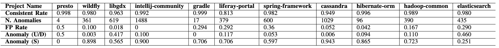

# Java naming anomalies
## Source
The original data comes from: https://groups.inf.ed.ac.uk/cup/codeattention/, including 11 popular Java projects from Github. Details about these projects can be found on the main page of the data. 

## Method Names
The method names are extracted from the original data’s training and testing sets. The extracted names from 5 of the projects are stored in the ```java_names``` folder. The 11 method name files for each project can be found on: [Java Method Names](https://github.com/GoodNightIsabelle/Discover-Data-Quality-With-RIOLU-A-Replication-Package/releases/tag/data). 

## Detected Anomalies
We ran RIOLU on each method name dataset to infer the patterns. Based on the patterns, we filtered anomalous method names. We manually verified them as true positives (i.e., 1 for anomalies) or false positives (i.e., 0 for not an anomaly) based on the naming convention of Oracle (https://www.oracle.com/java/technologies/javase/codeconventions-namingconventions.html). For *Liferay-portal*, we labeled a subset of anomalies due to the large volume of the originally detected anomalies. Notice that the anomalies are labeled only according to the pattern conventions and do not consider the semantics. The detected anomalies from each project, along with their labels, are stored in the ```java_naming_anomalies``` folder. 

## Detection Statistics

